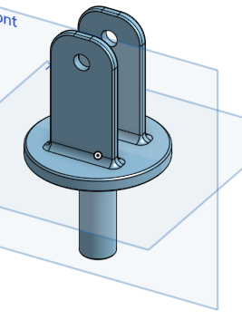
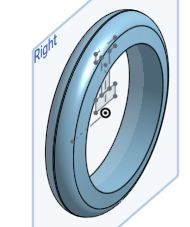
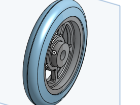

# BasicCAD

We are creating a caster.

---
## Table of Contents
* [Table of Contents](#Table-of-Contents)
* [Base](#Base)
* [Mount](#Mount)
* [Fork](#Fork)
* [Tire](#Tire)
* [Wheel](#Wheel)
* [AxleCollarBearings](#AxleCollarBearings)

## Base

### Description

The first assignment is to create the caster base.  The base's dimensions are 200 mm x 120 mm and 8 mm thick.  It has 6 holes 10 mm wide and 20 mm from the edge equally spaced along the edges.

### Evidence
[The Base in Onshape](https://cvilleschools.onshape.com/documents/0d70f655203ca304cb3c5b7d/w/f55603f962f6fc74f5548a68/e/41d730c570a8d75fce9f51b6)

### Image

### Reflection

This was my first Onshape part and [following along with Dr. Shields made it super easy.](https://www.youtube.com/watch?v=93BFUD-HAG8&feature=emb_title&scrlybrkr=5670f0b4)  I learned about 
* sketching (shortcut **shift-s**)
* constructions lines (shortcut **Q**)
* dimensions (shortcut **D**)
* extruding both add and remove (shortcut key **E**)
* linear patterns (no shortcut)

Onshape is awesome.  I found it really helpful to rename all my sketches.  It is going to be a GREAT year in engineering.

---

## Mount

### Description
this was my mount it really just involved a scaled rectangle.
### Evidence
[Mount](https://cvilleschools.onshape.com/documents/f9267e1b2cd95aa3acaf2426/w/53190cc2c3784edcf9003bfc/e/44e18eaa2b8d3e0239122604)
### Image

### Reflection
The mount was easy, although I had to redo it once.
---

## Fork

### Description
the fork is just a limited wall plug.
### Evidence
[My Fork is Here](https://cvilleschools.onshape.com/documents/f9267e1b2cd95aa3acaf2426/w/53190cc2c3784edcf9003bfc/e/44e18eaa2b8d3e0239122604)
### Image

### Reflection
The fork was rather simple and just required using fillet and chamfer, which round down edges.
---

## Tire

### Description
The tire was simply a revolved trapezoid, which was hard to make.
### Evidence
[My Tire](https://cvilleschools.onshape.com/documents/f9267e1b2cd95aa3acaf2426/w/53190cc2c3784edcf9003bfc/e/44e18eaa2b8d3e0239122604)
### Image

### Reflection
This one was slightly more tricky and I had to follow along in the video.
---

## Wheel

### Description
I made the inside part of a wheel which I struggled with.
### Evidence

[My Wheel](https://cvilleschools.onshape.com/documents/f9267e1b2cd95aa3acaf2426/w/53190cc2c3784edcf9003bfc/e/44e18eaa2b8d3e0239122604)
### Image

### Reflection
This one was really hard. I started off on the wrong plane but doing it next to the tire helped.
---

## AxleCollarBearings

### Description

### Evidence

### Image

### Reflection

---

